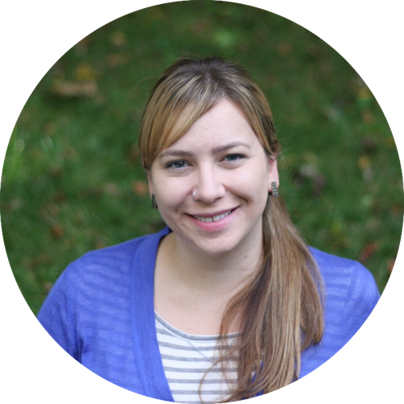

# Going Live
## Live Coding as an (Incredibly) Effective Tool for Teaching Programming

[USCOTS 2021](https://www.causeweb.org/cause/uscots/uscots21/workshop/10)  
Friday, June 25th, 2021  
4:00 pm – 6:00 pm ET  

---

### :computer: [Slides](https://mine-cetinkaya-rundel.github.io/golive-uscots/golive.html#1)
### :cloud: [RStudio Cloud](https://bitly.com/golive-cloud)

---

## Abstract

Just like staring at a slide with a fully derived proof is not an effective way of learning theory, staring at a script with complete code is also not an effective way of learning programming. Live coding (writing and running code while learners follow along) slows the instructor down (in a good way), motivates active learning, and highlights workflows. As evidenced by research, it’s the most effective way of teaching programming. Additionally, live coding inevitably causes instructors to make mistakes, which provides opportunities for teaching debugging, students to correct the instructor, and demonstrating that it's ok to make mistakes.

In this workshop, we will present best practices, tips, and tooling solutions for running effective live coding sessions for in-person and remote teaching and discuss potential drawbacks of live coding and how to avoid or work around them. We will start with a live coding session where the audience will get to participate as learners who are guiding the instructor through data exploration. We will also use breakout rooms to give participants a chance to practice live coding in smaller groups. Participants will have the option to use RStudio Cloud or their local R and RStudio install. We anticipate that most participants at USCOTS who teach programming know and teach R with RStudio, but a majority of the tips we provide would be applicable to teaching with other tools or in other languages as well.

## Instructor

[**Mine Çetinkaya-Rundel**](http://mine-cr.com/) (Duke University, RStudio) is Professor of the Practice position at the Department of Statistical Science at Duke University and Data Scientist and Professional Educator at RStudio. Mine’s work focuses on innovation in statistics and data science pedagogy, with an emphasis on computing, reproducible research, student-centered learning, and open-source education as well as pedagogical approaches for enhancing retention of women and under-represented minorities in STEM. Mine works on integrating computation into the undergraduate statistics curriculum, using reproducible research methodologies and analysis of real and complex datasets. She also organizes ASA DataFest, an annual two-day competition in which teams of undergraduate students work to reveal insights into a rich and complex dataset. Mine has been working on the OpenIntro project since its founding and as part of this project she co-authored four open-source introductory statistics textbooks (including this one!). She is also the creator and maintainer of datasciencebox.org and she teaches the popular Statistics with R MOOC on Coursera.