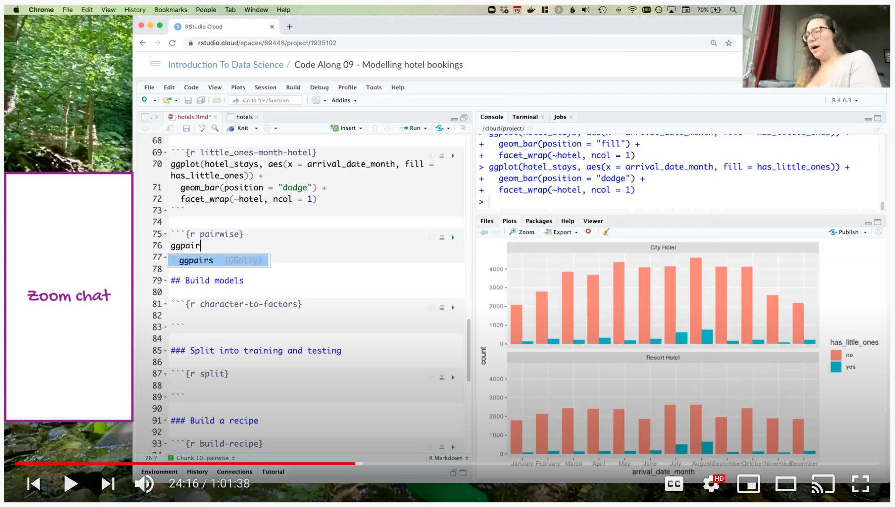
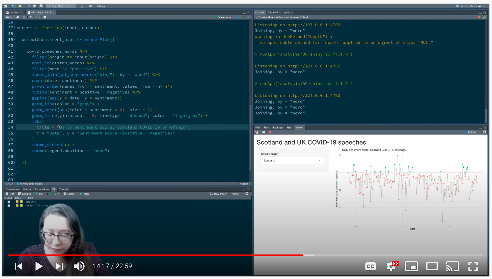
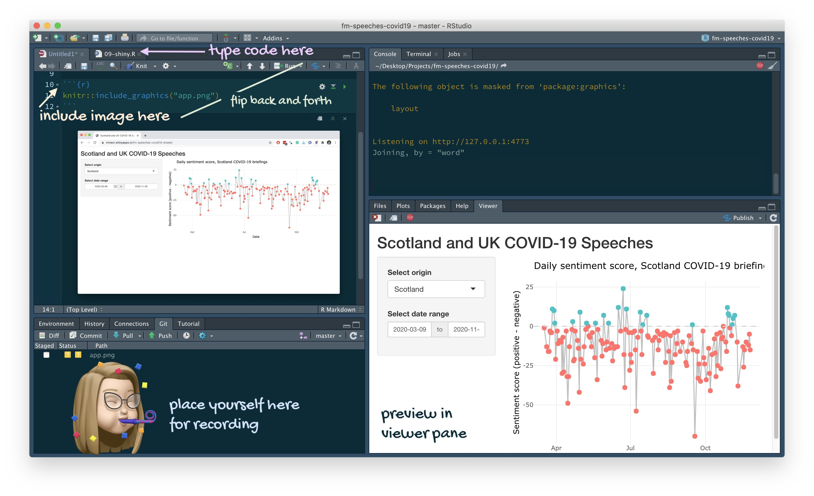

```{r setup, include = FALSE}
# R options
options(
  htmltools.dir.version = FALSE,
  dplyr.print_min = 6, 
  dplyr.print_max = 6,
  tibble.width = 65,
  width = 65
  )
# figure height, width, dpi
knitr::opts_chunk$set(fig.width = 8, 
                      fig.asp = 0.618,
                      out.width = "60%",
                      fig.align = "center",
                      dpi = 300)
# ggplot2
ggplot2::theme_set(ggplot2::theme_minimal(base_size = 16))
# xaringanExtra
library(xaringanExtra)
xaringanExtra::use_panelset()
library(countdown)
```

layout: true
  
<div class="my-footer">
<span>
<a href="https://bit.ly/golive-uscots" target="_blank">bit.ly/golive-uscots</a>
</span>
</div> 

---

class: middle

**Live coding:** Instead of presenting pre-written material, the teacher writes code in front of the class while the learners follow along, typing it in and running it as they go.

---

class: inverse, middle

# .hand[Why] code live?

---

class: middle

.hand[
Think back to your last math heavy course, one with proofs or problems that required multi-step solutions. 

Did you prefer to see all steps at once or prefer that the instructor walk through the steps at a reasonable pace, revealed them incrementally, and talked through their reasoning?
]

---

## Why live code?

- Slows you down

--
- Helps you articulate each step

--
- Allows you to demonstrate the workflow as well as the code

--
- Facilitates unintended knowledge transfer: people learn more than we are consciously teaching by watching how we do things

--
- (Most likely) causes you to make errors (that you can turn into teachable moments or use to show everyone makes errors!)

--
- Demonstrates the order in which programs should be written

--
- Gives teachers a chance to emphasize the importance of small steps with frequent feedback

--
- Saves you time

---

class: middle

## Why live code?

.hand[Now with empirical evidence...]

---

### [The effectiveness of live-coding to teach introductory programming](https://dl.acm.org/doi/10.1145/2445196.2445388)
*Rubin (2013)*  
*[doi.org/10.1145/2445196.2445388](https://doi.org/10.1145/2445196.2445388)*
 
- Audience: Introductory C++ course
- Treatment: instructors live code, control: instructors never type, only view, compile, and execute code examples
- Evidence: Pre/post surveys + grades
- "Based on our results, we conclude that teaching via live-coding is as good as if not better than using static code examples."

---

### [Role of Live-coding in Learning Introductory Programming](https://doi.org/10.1145/3279720.3279725)
*Raj, Patel, Halverson, Halverson (2018)*  
*[doi.org/10.1145/3279720.3279725](https://doi.org/10.1145/3279720.3279725)*
 
- Audience: Introductory data structures course
- Evidence: Pre/post test + open-ended feedback
- "We found that live-coding (1) makes the process of programming easy to understand for novice programmers, (2) helps students learn the process of debugging, (3) exposes students to good programming practices. [...] students prefer to code along with the instructor during a live-coding session rather than being mere observers."

---

## Why not *just* live code?

- Providing material multiple formats to learn from is better than providing just one

--
- Can be hard to follow if you're not careful

--
- Can be difficult to get a permanent record of (though this is less of a problem for virtual teaching)

---

class: inverse, middle

# .hand[What] to code live?

---

## Live code or not to live code

Any topic will benefit from livecoding, but for some using live coding as the **primary** communication method is more appropriate than others.

--

- Live code first:
  - RStudio IDE
  - Working with Git and GitHub
  - Using R Markdown
  - Making a reproducible example

--
- Static materials first, live code second:
  - Anything involving new syntax/API (dplyr, ggplot2, etc.)
  - Anything involving interpreting results
  - etc.

---

class: inverse, middle

# .hand[How] to code live?

---

class: middle

<iframe width="1200" height="530"  src="https://www.youtube.com/embed/Vacuk_kNOz8" frameborder="0" allow="accelerometer; autoplay; clipboard-write; encrypted-media; gyroscope; picture-in-picture" allowfullscreen></iframe>

---

class: middle

<iframe width="1200" height="530" src="https://www.youtube.com/embed/T5FKByBEe0c" frameborder="0" allow="accelerometer; autoplay; clipboard-write; encrypted-media; gyroscope; picture-in-picture" allowfullscreen></iframe>

---

## Live coding in person

- **Keep in mind:**
  - Room size
  - Audience size
  - Your own setup
  
- **Tip:** Don't rely on just the physical screen, use a secondary method to get your code in front of students' eyes (e.g. `r emo::ji("package")` [livecode](https://github.com/rundel/livecode))

---

## Live coding virtually

- **Keep in mind:** Audience watching on smaller devices
  
- **Tips:**
  - Test audience experience in a test run
  - If you have a live audience, give them plenty of opportunity and simple tooling to participate (e.g. Zoom chat)

---

## Virtual, live audience

```{r echo=FALSE, out.width="85%"}

```

---

## Virtual, prerecorded

```{r echo=FALSE, out.width="85%"}

```

---

## Live coding with strictly limited time

.hand[e.g. meetup presentations, conference talks, etc.]

- Consider pre-recording a screencast that you can narrate during the event, especially useful for showing workflow
  - Example: [Silent screencasts for teaching with RStudio Cloud](https://www.youtube.com/watch?v=Fz9UR6uxAG4&list=PLNUVZZ6hfXX05Bs80Hg5MjbOPnEFmwiOM&ab_channel=Mine%C3%87etinkaya-Rundel)
- Consider using [asciicast](https://github.com/r-lib/asciicast) if just presenting code

---

## Live coding - .hand[scripted]

.question[
**Demo:** Let's learn about data wrangling! 

- Go to [RStudio Cloud](https://bit.ly/golive-cloud): [bit.ly/golive-cloud](https://bit.ly/golive-cloud).
- Join the workspace.
- Click on **Projects** on the top bar.
- Click **START** for the project titled *Hotel bookings*.
- Watch me live code and follow along for Exercises 1 - 4.
]

---

## Live coding - .hand[scripted]

.your-turn[
**Your turn!**

- Go to [RStudio Cloud](https://bit.ly/golive-cloud): [bit.ly/golive-cloud](https://bit.ly/golive-cloud).
- Join the workspace.
- Click on **Projects** on the top bar.
- Click **START** for the project titled *Hotel bookings*.
- Rotate live coders for each exercise, for Exercises 5-8
- Add any comments/questions that come up during the breakout session at [bit.ly/golive-doc](https://bit.ly/golive-doc).
]

```{r echo=FALSE}
countdown(minutes = 15)
```

---

## Live coding - .hand[unscripted]

.demo[
**Demo:** Let's learn about parks! 

- Go to [RStudio Cloud](https://bit.ly/golive-cloud): [bit.ly/golive-cloud](https://bit.ly/golive-cloud).
- Join the workspace (if you haven't yet done so) and click on **Projects** on the top bar.
- Click **START** for the project titled *Parks*.
- Watch me live code, follow along, and participate in the chat.
]

---

## Livecoding pedagogy

- Build in delinerate fumbles and embrace your real mistakes

--
- Ask for predictions

--
- Take it slow

--
- Be seen and heard

--
- Mirror your learner's environment (then teach them customisation)

--
- Use screen wisely

--
- Double devices (when possible)

--
- Go beyond the code: draw diagrams

--
- Improvise (particularly with a live audience)

.footnote[
.small[
Greg Wilson. [Teaching Tech Together: How to Make Your Lessons Work and Build a Teaching Community around Them](https://teachtogether.tech/). CRC Press, 2019.
]
]

---

## Livecoding tips

- Disable notifications
--

- Omit or fully narrate keyboard shortcuts

--
- Use accessibility tools to enhance what's on your screen (e.g. [Mouseposé](https://boinx.com/mousepose/overview/) for Mac or [PointerFocus](http://www.pointerfocus.com/) for Windows)

--
- If need to type passwords, keep "off screen" notes handy that you can copy-paste from

--
- Use an RStudio addin to quickly switch to "factory settings" (e.g. `r emo::ji("package")` [addmins](https://github.com/mine-cetinkaya-rundel/addmins/blob/master/R/use_teach_mode.R))

---

## Livecoding tips

Avoid switching between screens

```{r echo = FALSE}

```

---

## Live coding - .hand[unscripted]

.your-turn[
**Your turn:** Let's explore Netflix titles! 

- Go to [RStudio Cloud](https://bit.ly/golive-cloud): [bit.ly/golive-cloud](https://bit.ly/golive-cloud).
- Click **START** for the project titled *Netflix titles*.
- Switch live coders every 5 minutes and improvise!
  - Info on dataset is [here](https://github.com/rfordatascience/tidytuesday/blob/master/data/2021/2021-04-20/readme.md)
- Take notes on what feels good/right, what is challenging, or any comments/questions that come up during the breakout session at [bit.ly/golive-doc](https://bit.ly/golive-doc).
]

```{r echo = FALSE}
countdown(minutes = 20)
```

---

class: middle

# .hand[Enhance] live coding

---

class: middle

.hand[
"Just google it!" is easier said than done! 

It’s important to take your students through the process of finding help as well as asking good questions to help you help them.
]

---

## (Not so good) help with googling

<br>

.center[
<iframe width="840" height="473" src="https://www.youtube-nocookie.com/embed/6tw5uOth4AY" frameborder="0" allow="accelerometer; autoplay; clipboard-write; encrypted-media; gyroscope; picture-in-picture" allowfullscreen></iframe>
]

---

## (Better) help with googling

<br>

.center[
<iframe width="840" height="473" src="https://www.youtube-nocookie.com/embed/2sp2isnqoFU" frameborder="0" allow="accelerometer; autoplay; clipboard-write; encrypted-media; gyroscope; picture-in-picture" allowfullscreen></iframe>
]

---

class: middle

# .hand[Sandbox] your live coding

---

## Sandbox your live coding with **learnr**

- Create your course slides using [learnr](https://rstudio.github.io/learnr/)
- Don't worry about writing automated feedback
- Use the code boxes as your sandbox for presenting limited amounts of code

--
- Example: [Making histograms with ggplot2](https://rstudio.cloud/learn/primers/3.3)

--
- Want to learn more about learnr? See [Feedback at scale](https://www.rstudio.com/resources/rstudioglobal-2021/feedback-at-scale/) and the materials that go along with it.

---

class: middle

# .hand[Learn more] about live coding

---

## Resources

- Live coding chapter in Teaching Tech Together by Greg Wilson, [in English](https://teachtogether.tech/en/index.html#s:performance-live) and [in Spanish](https://teachtogether.tech/es/index.html#s:performance-live)

- [Code live from RStudio, and share it with the World in real time](https://bitsandbricks.github.io/post/code-live-from-rstudio-and-share-it-with-the-world-in-real-time/) by H. Antonio Vazquez Brust

---

## Inspiration

- On YouTube:
  - [Julia Silge](https://www.youtube.com/channel/UCTTBgWyJl2HrrhQOOc710kA)
  - [David Robinson](https://www.youtube.com/channel/UCeiiqmVK07qhY-wvg3IZiZQ)
  - [Data Science in a Box / me!](https://www.youtube.com/watch?v=r-uTBEclM1E&list=PLNUVZZ6hfXX1tyUykCWShOKZdIB0TIhtM&index=3&ab_channel=Mine%C3%87etinkaya-Rundel) -- See any video with *AE* (application exercise) or *Code along* in the title
  
- On Twitch: See Jesse Mostipak's roundup of [data science streamers on Twitch](https://www.jessemaegan.com/blog/2021-05-28-data-science-twitch-streamers-round-up/) (including Jesse!)

---

class: middle

.center[
.huge[.hand[thank you!]]

.large[🔗 [bit.ly/golive-uscots](https://bit.ly/golive-uscots)]
]
